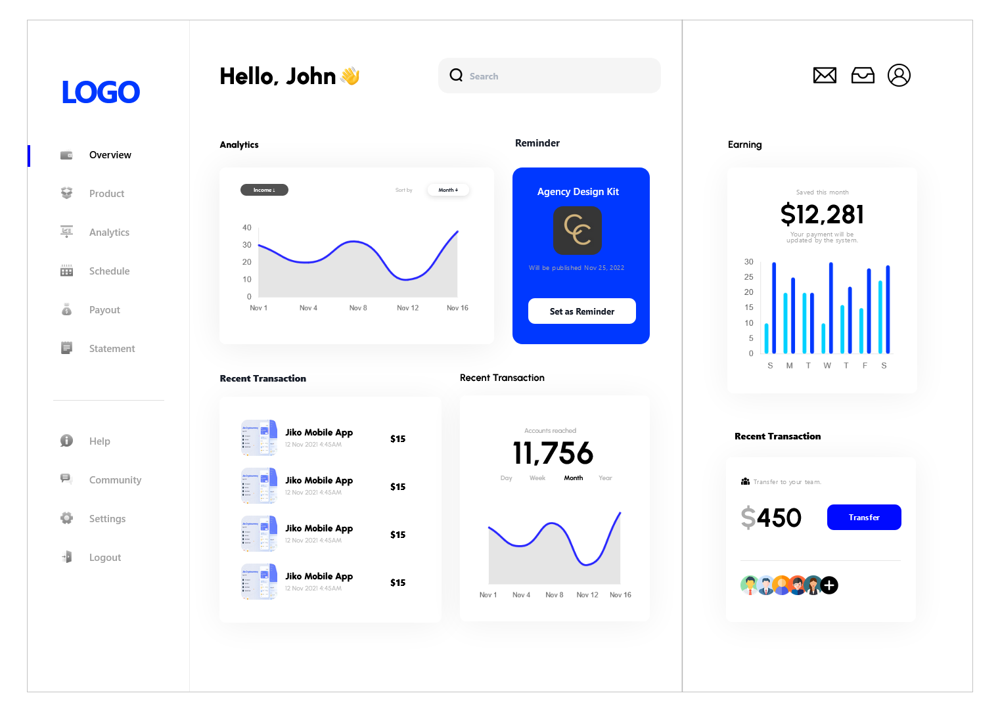

# Dashboard

Live Link - https://dashboard-corpcare.vercel.app/

### **In this assignment in order to manage all margin padding as given in figma I used height 1024px and width 1440px**
 

 

 
 
 
 
 
 

### A small Video Intro of My project hope you like it
 

<iframe src="https://drive.google.com/file/d/1YUv8cDKCoaQLb3OntmZrkBgbJrmfrkVS/view?usp=share_link" frameborder="0" allowfullscreen="true"> </iframe>

 

# Thanks 

